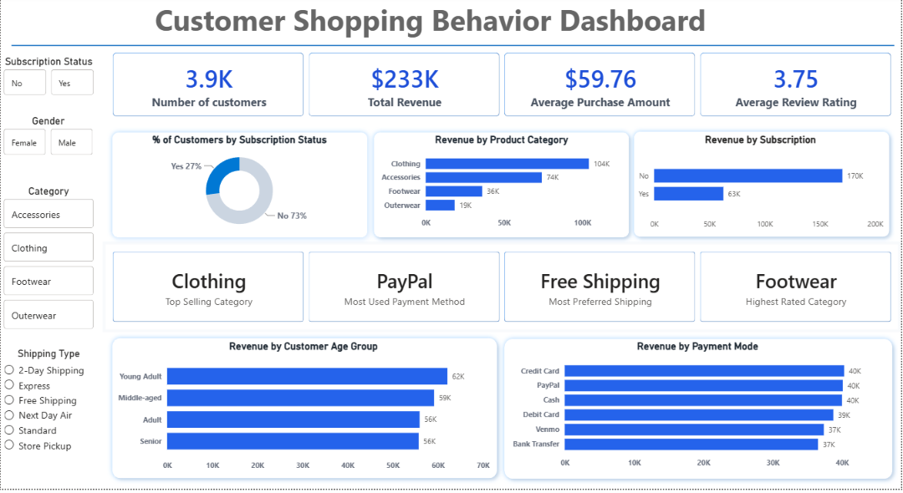

# 🛍️ Customer Shopping Behavior Analytics

An end-to-end Data Analytics project that analyzes customer purchasing behavior using **Python, SQL, and Power BI**. The project transforms raw retail transaction data into actionable business insights through data cleaning, exploratory data analysis (EDA), SQL queries, and an interactive Power BI dashboard.

---

# 📊 Dashboard Preview



---

# 🚀 Project Overview

This project focuses on understanding customer shopping patterns, revenue trends, subscription behavior, product performance, and payment preferences. It demonstrates the complete analytics workflow from raw data exploration to dashboard development.

---

# ✨ Key Features

- 📈 Interactive Power BI Dashboard
- 📊 Revenue Analysis by Product Category
- 👥 Customer Segmentation
- 💳 Payment Method Analysis
- 📦 Subscription Status Analysis
- 🚚 Shipping Preference Analysis
- ⭐ Product Rating Analysis
- 📋 KPI Cards for Business Metrics
- 🔍 Interactive Filters & Drill-down Analysis

---

# 📌 Dashboard KPIs

- 👥 Total Customers
- 💰 Total Revenue
- 💵 Average Purchase Amount
- ⭐ Average Review Rating

---

# 📊 Dashboard Insights

- 📦 Clothing generated the highest revenue.
- 💳 PayPal was the most preferred payment method.
- 🚚 Free Shipping was the most preferred shipping option.
- ⭐ Footwear received the highest customer ratings.

---

# 🛠️ Tech Stack

- Python
- Pandas
- NumPy
- SQL
- Power BI
- DAX
- Power Query
- Jupyter Notebook

---

# 📁 Project Structure

```
customer-behavior-analytics/
│
├── customer_behavior_dashboard.pbix
├── customer_shopping_analysis.ipynb
├── customer_shopping_behavior.csv
├── sql_queries.sql
├── README.md
└── images/
    └── dashboard.png
```

---

# 📈 Exploratory Data Analysis

Performed comprehensive EDA to understand:

- Customer demographics
- Spending behavior
- Product popularity
- Review ratings
- Payment trends
- Subscription patterns
- Shipping preferences

---

# 🗄️ SQL Analysis

Key SQL analyses include:

- Revenue by Product Category
- Revenue by Gender
- Revenue by Age Group
- Most Preferred Shipping Type
- Most Used Payment Method
- Highest Rated Category
- Customer Purchase Behavior

---

# 📊 Power BI Dashboard

The interactive dashboard provides:

- Dynamic KPI Cards
- Interactive Filters
- Revenue Distribution
- Customer Segmentation
- Product Insights
- Payment Insights
- Shipping Insights

---

# 🎯 Business Value

This dashboard enables businesses to:

- Identify high-performing product categories
- Understand customer purchasing behavior
- Optimize shipping strategies
- Improve marketing campaigns
- Track revenue performance
- Support data-driven decision making

---

# 👨‍💻 Author

**Devendra Kumar**

B.Tech | Materials & Metallurgical Engineering  
MANIT Bhopal

GitHub: https://github.com/DevendraKumar577
